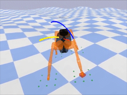

# teacher-student

This is an environment for learning quadrupedal locomotion depending on [bullet physics engine](https://github.com/bulletphysics/bullet3), containing:

- Interfaces of quadruped states, creating terrain from elevation maps and environmental states
- A PPO implementation and locomotion training with it
- Motor identification, i.e. Actuator Network
- Curriculum learning on disturbance and terrain
- Abundant command, force, torque, terrain and trajectory visualization 
- General Parallelism for accelerating training
- Imitation Learning from privileged teacher to proprioceptive student

<div align=center>

</div>

Requirements: `python>=3.9`, `pybullet>=3.2`, `torch>=1.10`, `numpy`, `scipy`, `wandb`

For train, run below for teacher:
```bash
python train_policy.py --mp-train --cuda --trn-type=curriculum --run-name=teacher_example \
    --num-envs=16 --storage-len=128 --num-iters=5000 --rand-dyn --actuator-net=history \
    --add-disturbance --task-type=randCmd --centralized --aggressive --entropy-coeff=3e-3 \
    --latency-range='(0.,0.03)'
```

for student:
```bash
python train_student.py --mp-train --cuda --trn-type=curriculum --run-name=student_example \
     --model-path='find(teacher_example)'  --num-envs=16 --num-iters=100 \
     --rand-dyn --actuator-net=history --add-disturbance --task-type=randCmd \
     --centralized --aggressive --repeat-times=1 --save-interval=5 --history_len=123
```
