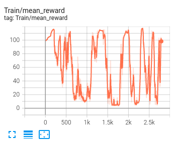
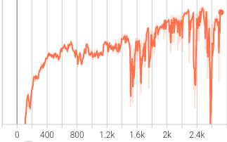
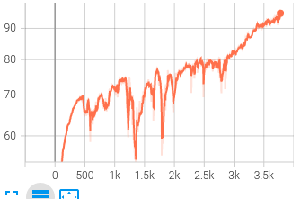

# teacher-student

_Nov20_

- base_twist的测量值从世界坐标系改为基体坐标系
- 对action、TG的基准频率clip
- 修改了原PPO中的noise_std（1.0是否太大了？）
- is_safe的判定更加严格，但仍需要继续考虑（序列的指标）
- 提高速度奖励的权重，训练中可以很快学会站定，但倾向于向前倒

_Nov21_

- multiprocess的效率太低，如果每步step都创建线程，花的时间是单线程的15~20倍（32环境4线程）
    - 创建线程 ～5ms
    - 循环时间（+start）～40ms
    - 等待时间（join）3e-4～40ms
    - 单线程32环境step ～100ms
    - **注：此时代码写错，但结论没有太大差距**
- 取消对action的clip，否则会学到一个很诡异的余差（z>0），导致不再迭代；
考虑直接在action超限时terminate
- 研究ppo的算法

_Nov22_

- getJointStates的力和力矩的意义不明，接触力改用getContactPoints
- 重构了底层代码，删除legged_gym意义不明的代码

_Nov23_

- 重新找回legged_gym的代码，其使用GAE估计优势
- 增加TG输入和输出的系数，增加输入的标准化，使训练初期变得稳定
- 增大了最长回合数

_Nov24_

- 学习率1e-3有尖峰，1e-4跌落后上不去（经验池24）
- 经验池128，有学习的迹象，最终还是崩掉了
- 将步态初始值设为固定的($0$, $\pi/2$, $\pi$, $3\pi/2$)，开始稳定但会跌落
- 最终在100和10之间跳跃，尚不知为何



_Nov25_

- 取消TG频率改变，获取经验一次学习4次，在很短时间内学会站立不动
- 恢复TG频率改变，成啦！参数：8env，128storage，learn4次，奖励0.06linear，
0.05angular，0.03stable，学习率1e-4，在1e6次左右学到，但有转弯的倾向，且到后面似乎不太稳定

```python
num_learning_epochs = 4,
num_mini_batches = 1,
clip_param = 0.2,
gamma = 0.995,
lam = 0.95,
value_loss_coef = 1.0,
entropy_coef = 0.0,
learning_rate = 1e-4,
max_grad_norm = 1.0,
use_clipped_value_loss = True,
schedule = "fixed",
desired_kl = 0.01,
device = 'cuda',
```

- 试了一下多进程multiprocessing，每个环境跑step和reset，汇总到主进程决策，
单位时间处理iteration快3～4倍（时间1/4到1/5左右）。env的所有操作必须在进程中完成。
- clip_param=0.1，抖动剧烈，Z轴很快下沉

_Nov26_
- 增大经验池似乎对稳定性很有帮助

  

- Z轴高度奖励似乎作用不大
- 总体而言动作有点拖泥带水

_Nov27_
- 奖励更多可能会导致训练的潜力变大、过程更稳定（限定策略更新的方向）

  

_Nov30_
- bug修复之前凹凸地形的训练效果并不良好，可以稳定，单很难向前走（0.03m)
- bug修复之后平地效果似乎更稳定

_Dec01_
- 在平地的奖励分布似乎很难驱动机器人在凹凸地形上行走
- 降低力矩和目标突变惩罚可以在凹凸地形行走，但两次都有摇摆的情况
- 感觉凹凸地形训练的时候有一个阈值，如果一步迈出去有一点点奖励增加，机器人就会开始向前迈；否则只会原地踏步


_Stage2_

- 数据增加噪声
- terrain curriculum